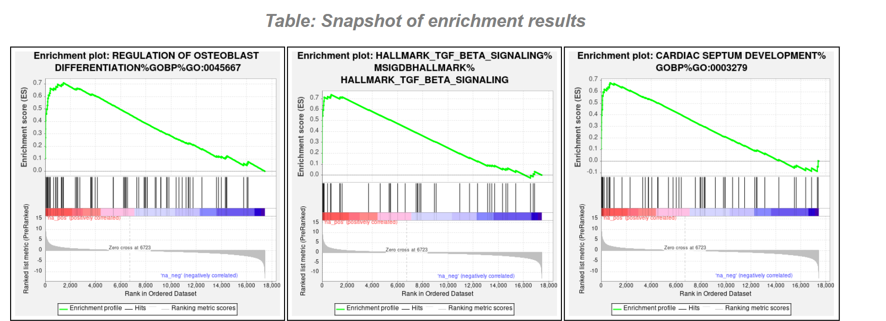
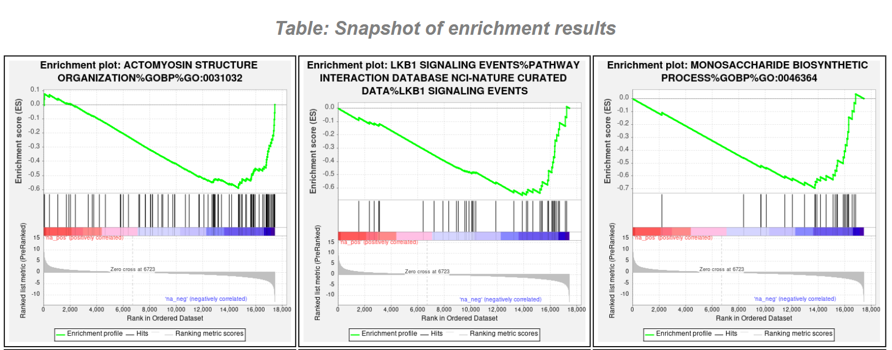
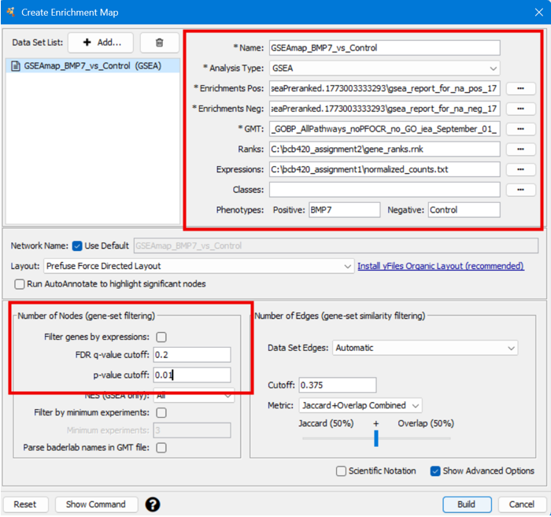
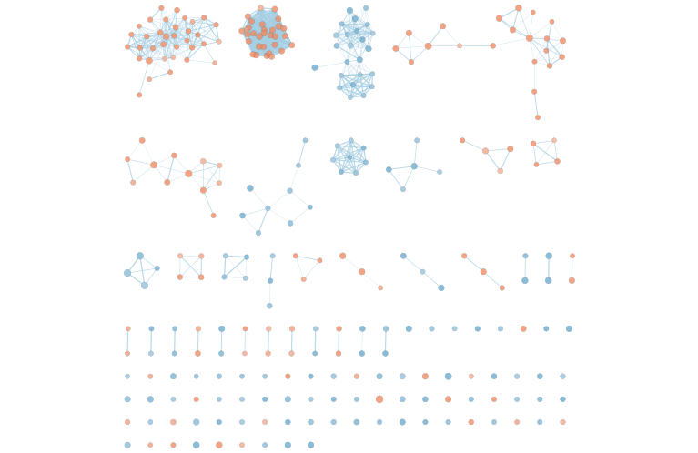
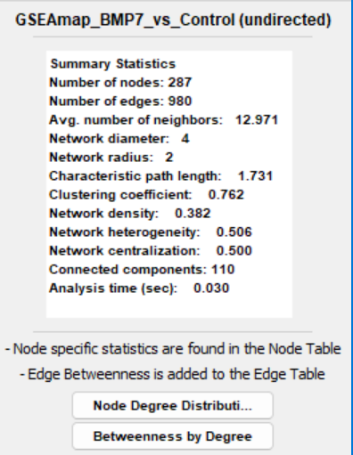
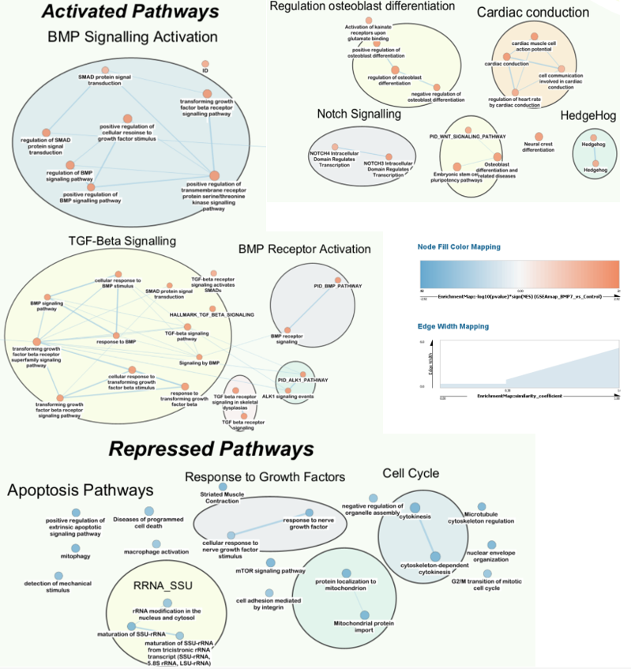
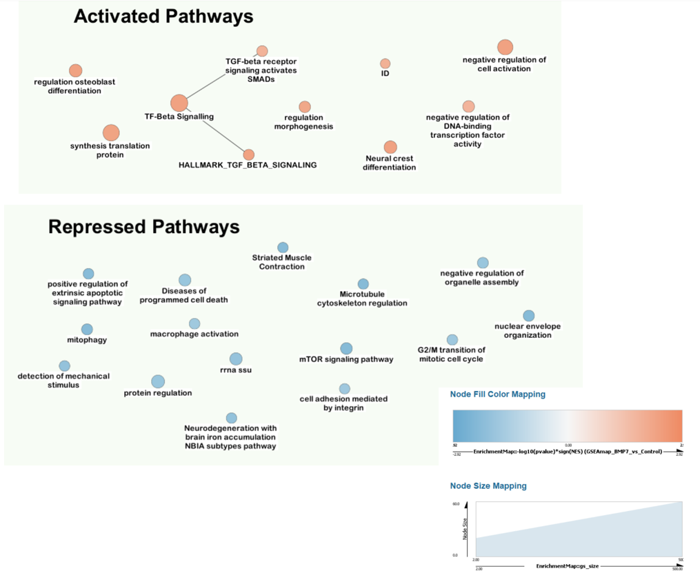

# Introduction
Medulloblastoma (MB) is a pediatric brain cancer with around 5 cases per 1 million individuals [@cooney2023], occurring due to oncogenic events perturbing the development and differentiation of cerebellar progenitor cells. Bone morphogenetic protein (BMP) plays an important role in cellular differentiation, and has been previously linked to contributing to the development of medulloblastoma. However the exact role that BMP plays clinically and mechanistically in the development of this disease is unknown. 

Ohata et al. aimed to explore the mechanisms of the BMP pathways that contribute to the development of medulloblastoma. To investigate this, Ohata et al, performed a bulk RNA-seq experiment designed to identify differences in gene expression in medulloblastoma cell lines (CHLA01, CHLA01R, MB002, and D425) treated with BMP7 ligand for 72 hours and compared them to PBS-treated controls [@ohata2025].

## Summary of Previous Analysis

* **GEO Accession:** [GSE229150](https://www.ncbi.nlm.nih.gov/geo/query/acc.cgi?acc=GSE229150)
* **Publication:** [The transcription factor LHX2 mediates and enhances oncogenic BMP signaling in medulloblastoma](https://www.nature.com/articles/s41418-025-01488-6)

The [GSE229150](https://www.ncbi.nlm.nih.gov/geo/query/acc.cgi?acc=GSE229150) dataset was obtained from the Gene Expression Omnibus (GEO) 
database using the GEOquery [@geoquery] Bioconductor package. 
The collation process transformed 30 separate files into a 66,023 × 30 unified count matrix, with ENSEMBL gene IDs and gene symbols from the original dataset.

In our first analysis, we processed this dataset by removing low read counts and performed identifier mapping before applying Trimmed Mean of M-values (TMM) normalization. After cleaning and normalizing the data, our bulk RNA-sequencing experiment retained 17462 genes. This was then followed by differential expression analysis using edgeR [@edger], which was restricted to BMP vs Control comparisons within the CHLA01 cell line (3 CHLA01-BMP samples) to understand treatment-specific transcriptional changes.

Let us look at the tagwise differential expression results table generated by the quasi-likelihood (QL) test.

```{r, message=FALSE, warning=FALSE}

# Load differential expression results from a csv file
differential_expression_data <- read.csv("A1_differential_expression_results.csv")

# View results
colnames(differential_expression_data)[1] <- "GeneSymbol"
head(differential_expression_data)
```

**Table 1. Top differentially expressed genes from the quasi-likelihood (QL) test comparing BMP-treated versus Control samples, showing log-fold changes, average expression, and associated p-values.**

For more information on my initial analysis, view my [analysis](A1_TanayaDatar.html).

Utilizing the results from Assignment 1, we will now perform enrichment analysis to identify pathways that are significantly enriched among genes that are up- or down-regulated in our BMP samples.

## Loading Libraries
To begin our pathway analysis, we must first load all relevant libraries that we will use to process and analyze our dataset. `dplyr`[@dplyr] and `tidyverse`[@tidyverse] packages are used for data manipulation. `gprofiler2`[@gprofiler] is used to perform over-representation analysis on our gene lists. `htmltools`[@htmltools] is used for embedding external HTML content, here GSEA reports, directly into our notebook. `knitr`[@knitr] is used to format and render RMarkdown plots.

```{r, message=FALSE, warning=FALSE, error=FALSE, results='hide'}

# Install packages
if (!requireNamespace("BiocManager", quietly = TRUE))
  install.packages("BiocManager")
if (!requireNamespace("tidyverse", quietly = TRUE))
  install.packages("tidyverse")
if (!requireNamespace("htmltools", quietly = TRUE))
  install.packages("htmltools")

# Loading required libraries
library(tidyverse)
library(gprofiler2)
library(dplyr)
library(htmltools)
library(knitr)
```

# Thresholded Analysis
Over-Representation Analysis (ORA) is a statistical method used to identify whether specific biological pathways or gene sets are significantly enriched in our genes of interest. To perform ORA, we begin with our differently expressed gene list as in Table 1 and compare it against curated gene sets or pathways from annotation databases. The central question we ask is: Are any of these gene sets surprisingly or statistically over-represented in our gene list compared to what we would expect by random chance?[@professor_lectures]

To answer this question rigorously, we can employ a thresholded approach.
Let us filter genes from our differential expression analysis using a statistical threshold to create a discrete set of significant genes. 

We declare a gene as significantly upregulated if it has a p-value < 0.05 and a log fold change > 1 and declare significantly downregulated genes as those with a p-value < 0.05 and a log fold change < -1. These limits are based on our previous thresholds to identify statistically significant genes in Assignment 1 [@threshold]. We also generate a combined gene list which is a combination of the upregulated and downregulated gene sets. The advantage of combining up- and down-regulated genes, is that we can capture dysregulated pathways that may contain both activated and repressed genes, which might be missed when analyzing up- or down-regulated genes separately.

```{r, message=FALSE, warning=FALSE}

# Generate up-regulated list
up_genes <- differential_expression_data %>%
  dplyr::filter(PValue < 0.05, logFC > 1) %>%
  dplyr::pull(GeneSymbol)


# Generate down-regulated list
down_genes <- differential_expression_data %>%
  dplyr::filter(PValue < 0.05, logFC < -1) %>%
  dplyr::pull(GeneSymbol)

# Generate combined list
combined_genes <- unique(c(up_genes, down_genes))

# Number of up-regulated genes
cat("Number of up-regulated genes:", length(up_genes), "\n")

# Number of down-regulated genes
cat("Number of down-regulated genes:", length(down_genes), "\n")

# Number of combined genes
cat("Number of combined-regulated genes:", length(combined_genes), "\n")


```
## Methods
In order to perform our thresholded over-representation analysis we will use the tool g:Profiler. We selected g:Profiler because it is widely used and provides frequently updated gene annotations, which helps ensure that enrichment results reflect the most current biological knowledge. It also integrates multiple pathway and functional databases, including Gene Ontology Biological Process, Reactome, and WikiPathways, allowing for broader functional interpretation of gene sets. [@gprofiler]

For the annotation resource, we will use a custom GMT gene-set file curated by the Bader Lab. This file integrates pathway and functional annotations from multiple databases, including HumanCyc, Panther, Pathbank, Gene Ontology Biological Process, Reactome, and WikiPathways, as well as additional curated pathway collections beyond those available in tools such as g:Profiler, allowing enrichment analysis across a broader set of biological pathways and functional processes. We selected this annotation resource because the Bader Lab regularly curates and updates these gene sets (monthly), ensuring that the annotations reflect current biological knowledge. Additionally, this dataset removes electronically inferred annotations (IEA) and redundant pathway collections, which helps improve the reliability and interpretability of enrichment results.[@baderlab_2025_gmt]

The specific annotation version used in this analysis was `Human_GOBP_AllPathways_noPFOCR_no_GO_iea_September_01_2025_symbol.gmt`, corresponding to the September 01, 2025 release downloaded from the Bader Lab gene-set repository. [@baderlab_2025_gmt]

Prior to performing the thresholded enrichment analysis, the GMT gene set file was pre-filtered to include only pathways containing between 15 and 100 genes. Pre-filtering removes very small or very large gene sets that are often uninformative and ensures that multiple hypothesis testing correction is applied only to relevant pathways, resulting in more statistically robust enrichment results. To learn more about my filtering approach, view my [Journal Entry](https://github.com/bcb420-2026/Tanaya_Datar/wiki/Pre%E2%80%90filtering-of-GMT-file).

## Up-regulated Differential Expression Analysis
Let’s run `gprofiler2` with the up-regulated genes.

```{r, message=FALSE, warning=FALSE}

# Upload the downloaded GMT file to g:Profiler to use it as a custom gene set database for enrichment analysis
# The function returns an ID that you can use as the 'organism' parameter in g:Profiler
custom_gmt <- gprofiler2::upload_GMT_file(
  gmtfile = "Human_GOBP_symbol_15_100_thresholded.gmt"
)

# Declare query set for enrichment analysis
query_set <- up_genes

# Run g:profiler on the query set
gprofiler_up <- gprofiler2::gost(
  query = query_set,           # List of genes to test for enrichment
  significant = TRUE,         # Return results passing g:Profiler's default significance threshold
  ordered_query = FALSE,       # The gene list is treated as unordered (no ranking applied)
  exclude_iea = TRUE,          # Exclude GO terms inferred from electronic annotation (IEA)
  correction_method = "fdr",   # Apply false discovery rate (FDR) correction for multiple hypothesis testing
  organism = custom_gmt # Use our custom GMT file
)

# Convert results into a dataframe and remove unnecessary columns
results_up <- as.data.frame(gprofiler_up$result) %>%
  select(-query, -query_size, -recall, -significant, -effective_domain_size, -source_order, -parents)

# View the results
head(results_up)

```

**Table 2. Table of significantly enriched pathways for up-regulated genes, with default g:Profiler threshold (corrected p-value < 0.05) showing pathway ID, name, p-value, and size.**

*This code was inspired by CBW pathways workshop "Run G:Profiler from R" notebook [@isserlin_gprofiler_r_notebook].*


```{r, message=FALSE, warning=FALSE}
# Check how many enriched gene sets were returned
cat("Number of gene sets returned:", nrow(results_up), "\n")
```
88 gene sets were returned with default g:Profiler threshold (corrected p-value < 0.05), FDR correction, custom GMT file with genesets(15-100) and IEA exclusion for up-regulated genes

## Down-regulated Differential Expression Analysis

Let’s run `gprofiler2` with the down-regulated genes.
```{r, message=FALSE, warning=FALSE}

# Declare query set for enrichment analysis
query_set <- down_genes


# Run g:profiler on the query set
gprofiler_down <- gprofiler2::gost(
  query = query_set,           # List of genes to test for enrichment
  significant = TRUE,         # Return results passing g:Profiler's default significance threshold
  ordered_query = FALSE,       # The gene list is treated as unordered (no ranking applied)
  exclude_iea = TRUE,          # Exclude GO terms inferred from electronic annotation (IEA)
  correction_method = "fdr",   # Apply false discovery rate (FDR) correction for multiple hypothesis testing
  organism = custom_gmt # Use our custom GMT file
)

# Convert results into a dataframe and remove unnecessary columns
results_down <- as.data.frame(gprofiler_down$result) %>%
  select(-query, -query_size, -recall, -significant, -effective_domain_size, -source_order, -parents)

# View the results
head(results_down)


```

**Table 3. Table of significantly enriched pathways for down-regulated genes, with default g:Profiler threshold (corrected p-value < 0.05) showing pathway ID, name, p-value, and size.**

*This code was inspired by CBW pathways workshop "Run G:Profiler from R" notebook [@isserlin_gprofiler_r_notebook].*

```{r, message=FALSE, warning=FALSE}
# Check how many enriched gene sets were returned
cat("Number of gene sets returned:", nrow(results_down), "\n")

```
19 gene sets were returned with default g:Profiler threshold (corrected p-value < 0.05), FDR correction, custom GMT file with genesets(15-100) and IEA exclusion for down-regulated genes.

## Combined Differential Expression Analysis
Let’s run `gprofiler2` with the combined genes.

```{r, message=FALSE, warning=FALSE}

# Declare query set for enrichment analysis
query_set <- combined_genes


# Run g:profiler on the query set
gprofiler_combined <- gprofiler2::gost(
  query = query_set,           # List of genes to test for enrichment
  significant = TRUE,         # Return results passing g:Profiler's default significance threshold
  ordered_query = FALSE,       # The gene list is treated as unordered (no ranking applied)
  exclude_iea = TRUE,          # Exclude GO terms inferred from electronic annotation (IEA)
  correction_method = "fdr",   # Apply false discovery rate (FDR) correction for multiple hypothesis testing
  organism = custom_gmt # Use our custom GMT file
)

# Convert results into a dataframe and remove unnecessary columns
results_combined <- as.data.frame(gprofiler_combined$result) %>%
  select(-query, -query_size, -recall, -significant, -effective_domain_size, -source_order, -parents)

# View the results
head(results_combined)

```

**Table 4. Table of significantly enriched pathways for combined genes (up and down regulated), with default g:Profiler threshold (corrected p-value < 0.05) showing pathway ID, name, p-value, and size.**

*This code was inspired by CBW pathways workshop "Run G:Profiler from R" notebook [@isserlin_gprofiler_r_notebook].*

```{r, message=FALSE, warning=FALSE}

# Check how many enriched gene sets were returned
cat("Number of gene sets returned:", nrow(results_combined), "\n")

```
96 gene sets were returned with default g:profiler threshold (corrected p-value < 0.05), FDR correction, custom GMT file with genesets(15-100) and IEA exclusion for combined genes.


**INFERENCE:**

```{r, message=FALSE, warning=FALSE}

# Checking overlapping pathways between up, down, and combined
up_terms <- results_up$term_name
down_terms <- results_down$term_name
all_terms <- results_combined$term_name

# Terms unique to each
up_only <- setdiff(up_terms, union(down_terms, all_terms))
down_only <- setdiff(down_terms, union(up_terms, all_terms))
combined_only <- setdiff(all_terms, union(up_terms, down_terms))

# Terms shared between pairs
shared_up_down <- intersect(up_terms, down_terms)
shared_up_combined <- intersect(up_terms, all_terms)
shared_down_combined <- intersect(down_terms, all_terms)

# Terms shared across all three
shared_all <- intersect(up_terms, intersect(down_terms, all_terms))

# View results
cat("Pathways unique to up-regulated:", length(up_only), "\n")
cat("Pathways unique to down-regulated:", length(down_only), "\n")
cat("Pathways unique to combined:", length(combined_only), "\n")
cat("Shared between up and down:", length(shared_up_down), "\n")
cat("Shared between up and combined:", length(shared_up_combined), "\n")
cat("Shared between down and combined:", length(shared_down_combined), "\n")
cat("Shared across all three:", length(shared_all), "\n")

```

1. No pathways were shared across all three analyses, and no pathways were shared between the up-regulated and down-regulated sets, suggesting that the two gene sets are driving distinct and non-overlapping biological processes.

2. The combined analysis shared 51 pathways with the up-regulated set and 18 with the down-regulated set, indicating it is largely dominated by the up-regulated signal, consistent with the skewed nature of our ranked gene list mentioned in the [**Journal**](https://github.com/bcb420-2026/Tanaya_Datar/wiki/A2-Progress-Updates#932026)

3. Pathways unique to the up-regulated analysis include biologically relevant terms such as "Signaling by BMP", "TGF-beta signaling pathway", "regulation of BMP signaling pathway", all of which are directly relevant to the BMP7-driven oncogenic mechanism described in Ohata et al. [@ohata2025].

4. The single pathway unique to the down-regulated analysis ("negative regulation of potassium ion transport") and the 27 pathways unique to the combined analysis (e.g. collagen formation) do not appear directly relevant to the medulloblastoma BMP7 signalling context, likely reflecting noise or secondary transcriptional effects introduced by combining opposing gene sets.

5. Overall, analyzing up-regulated and down-regulated genes separately is more informative than the combined approach for this dataset, as the combined analysis dilutes the BMP-specific signal with biologically unrelated pathways.

## Interpretation
The Ohata et al. paper [@ohata2025] directly supports several of our up-regulated pathways from g:Profiler analysis. Most notably:

- **ID proteins:** The paper states: "ATOH1/MATH1 can be inhibited by ID proteins, whose expression is potently induced by BMPs in every tissue, suggesting an oncogenic role for BMP signaling in MB [@ohata2025]" The significant enrichment of the ID pathway in our upregulated genes (p=7.581418e-04) validates ID protein upregulation as a canonical BMP7 response in medulloblastoma.

- **SMAD signaling and BMP pathway regulation:** The paper demonstrates that BMP7 induces LHX2 through SMAD1/5/4 activation: "Simultaneous silencing of the three main SMAD mediators of BMP7 signaling, SMAD1, SMAD4, and SMAD5, in D425 MB cells, significantly inhibited BMP7-mediated induction of LHX2 mRNA expression [@ohata2025]" This directly supports the upregulation of BMP signaling pathway components and SMAD-related genes in our dataset.

While the Ohata et al. paper does not specifically discuss muscle gene suppression in medulloblastoma, the downregulation of these pathways is consistent with the paper's core mechanism: BMP7-LHX2 signaling promotes a stem-like, undifferentiated phenotype while actively suppressing alternative developmental lineages, including myogenic differentiation.
The downregulation of muscle contraction genes likely reflects this broader repression of terminal differentiation programs in favor of maintaining an oncogenic, stem-like state.

There exists supporting evidence in the broader literature that explains why BMP7 treatment induces these seemingly contradictory pathways.

- Wu et al's paper [@TGF] states that BMPs promote osteogenesis at all differentiation stages, which directly explains why "regulation of osteoblast differentiation" is our top enriched upregulated pathway. Additionally, BMPs belong to the TGF-β superfamily, and hence explains why "transforming growth factor beta receptor signaling pathway" is an enriched upregulated pathway.


- Ye et al. [@bmp_cardiovascular] and Shi et al. [@muscle_bmp] demonstrate that BMPs fundamentally suppress myogenesis through SMAD-mediated signaling. Specifically, they show that enhanced BMP signaling actively represses muscle gene expression and myogenic differentiation. This tells us that BMPs have opposing effects on bone and muscle lineages simultaneously promoting osteogenic differentiation while suppressing myogenic differentiation.


# Non-thresholded Gene set Enrichment Analysis

Non-thresholded analysis examines the full ranked list of genes without applying a significance cutoff, allowing downstream methods such as Gene Set Enrichment Analysis to detect coordinated patterns across the entire dataset rather than only among individually significant results [@professor_lectures].

This analysis was performed using the method Gene Set Enrichment Analysis (GSEA)[@GSEA]. GSEA was selected because it evaluates enrichment across a ranked list of all genes without requiring an arbitrary significance threshold, enabling detection of coordinated but modest expression changes across biological pathways. In addition, the GSEA desktop interface allows interactive exploration of parameters and gene set collections, making it possible to test and refine analysis settings before implementing the final workflow programmatically in R.

For our non-thresholded analysis genesets we will use the same GMT file Human_GOBP_AllPathways_noPFOCR_no_GO_iea, that we used for our thresholded analysis.
Using the same GMT file for both thresholded and non-thresholded analyses ensures that the pathways tested are identical, allowing for a direct comparison of the results and highlighting differences in pathway enrichment between the two approaches. We specifically are using the Human_GOBP_AllPathways_noPFOCR_no_GO_iea_September_01_2025_symbol.gmt file [@baderlab_2025_gmt]. For more information, on why this GMT file was chosen see [**thresholded analysis**](#methods).

```{r, message=FALSE, warning=FALSE}

# Define the URL for the Bader Lab GMT file
# This GMT file contains curated human pathways (Gene Ontology Biological Process + other pathways) and it excludes GO terms inferred from electronic annotation (IEA) and post-filtered terms

gmt_url <- "https://download.baderlab.org/EM_Genesets/September_01_2025/Human/symbol/Human_GOBP_AllPathways_noPFOCR_no_GO_iea_September_01_2025_symbol.gmt"

# Download the GMT file from the URL and save it locally
download.file(
  url = gmt_url,
  destfile = "Human_GOBP_AllPathways_noPFOCR_no_GO_iea_September_01_2025_symbol.gmt"
)

# Path to GSEA CLI in the docker container
gsea_jar <- "/home/rstudio/GSEA_4.4.0/gsea-cli.sh"

# Working directory (where my data is)
working_dir <- "/home/rstudio/projects"

# Output directory
output_dir <- "/home/rstudio/projects/GSEA_results"

# Analysis label
analysis_name <- "A2_GSEA"

# Rank file name
rnk_file <- "gene_ranks.rnk"

# Path to your downloaded GMT file
gmt_file <- "Human_GOBP_AllPathways_noPFOCR_no_GO_iea_September_01_2025_symbol.gmt"

# Flag to run GSEA
run_gsea <- FALSE # Set to FALSE to skip running GSEA when knitting
```


```{r, message=FALSE, warning=FALSE}

# Create ranked file where genes were ordered by the score (-log10(Pvalue) * sign(logFC))
ranked_genes <- differential_expression_data %>%
  dplyr::mutate(rank = -log10(PValue) * sign(logFC)) %>%
  dplyr::arrange(desc(rank)) %>%
  dplyr::select(GeneSymbol, rank)


# Save the file
write.table(
  ranked_genes,
  "gene_ranks.rnk",
  sep="\t",
  row.names=FALSE,
  col.names=FALSE,
  quote=FALSE
)


```

```{r, message=FALSE, warning=FALSE}

if(run_gsea){# Only run GSEA if the flag is TRUE

  # Build the command to run GSEA Preranked from the Java .jar
  command <- paste(
    gsea_jar, # Path to the GSEA .jar file
    "GSEAPreranked",  # Specify preranked GSEA mode
    "-gmx", gmt_file, # GMT file containing gene sets
    "-rnk", file.path(working_dir, rnk_file), # Ranked gene list we generated
    "-collapse false", # Do not collapse probe sets (for gene symbols)
    "-nperm 1000",   # Number of permutations for FDR calculation
    "-scoring_scheme weighted",   # Weighted enrichment score (accounts for ranking)
    "-rpt_label", analysis_name, # Label for this analysis
    "-plot_top_x 20",  # Generate plots for top 20 gene sets
    "-rnd_seed 12345", # Random seed for reproducibility 
    "-set_max 100", # Maximum gene set size to include
    "-set_min 15",  # Minimum gene set size to include
    "-zip_report false",   # Do not zip the output reports
    "-out", output_dir,  # Output directory for results
    "> gsea_output.txt" # Redirect console output to a text file
  )

  system(command) # Execute the command in the system shell

}

```

*This code was inspired by CBW pathways workshop "Run GSEA from within R" notebook [@isserlin_gsea_r_notebook].*

We performed GSEA using the ranked gene list, where genes were ordered by the score (-log10(Pvalue) * sign(logFC))and saved as a .rnk file. The analysis was run with 1,000 permutations, using the same gene set size limits (set_min = 15, set_max = 100) as our thresholded analysis to ensure an apples-to-apples comparison of pathway enrichment. If you wish to perform GSEA, please set the flag `run_gsea` to TRUE.

## Summary of Results

```{r, message=FALSE, warning=FALSE}

# List all GSEA preranked result directories in the output folder
gsea_directories <- list.files(path = output_dir, pattern = "\\.GseaPreranked")

# Retrieve metadata (file info) for each of these directories
details <- file.info(file.path(output_dir, gsea_directories))
# Sort directories by modification time (newest first)
details <- details[with(details, order(as.POSIXct(mtime), decreasing = TRUE)), ]

# Select the most recent GSEA output directory
gsea_output_dir <- row.names(details)[1]
# Construct the full path to the index.html file of the GSEA report
gsea_results_filename <- file.path(gsea_output_dir, "index.html")

# Embed the GSEA HTML report directly in the RMarkdown using an iframe
htmltools::tags$iframe(
  src = gsea_results_filename,
  height = "800px",
  width = "100%",
  frameborder = "0"
)

```

**Summary 1: Embedded GSEA preranked report depicting pathway enrichment results**

*This code was inspired from a GeeksforGeeks webpage [@html_iframes_2026].*


**INFERENCE**

1. A total of 881 gene sets showed positive enrichment scores, indicating that genes within these sets are upregulated in response to BMP7 treatment. Of these, 364 gene sets achieved statistical significance at FDR < 25%, with 153 gene sets reaching high significance at a nominal p-value < 1%. 

2. A total of 4,086 gene sets showed negative enrichment scores, indicating that genes within these sets are downregulated in response to BMP7 treatment. Of these, 414 gene sets achieved statistical significance at FDR < 25%, with 220 gene sets reaching high significance at a nominal p-value < 1%.

3. GSEA identified multiple significantly enriched pathways upregulated in response to BMP7 treatment. The top enriched positive pathways include regulation of osteoblast differentiation, TGF-β signaling, and cardiac septum development (Figure 1). The characteristic leftward skew of gene distribution in these enrichment plots demonstrates that genes comprising these gene sets are predominantly upregulated following BMP7 stimulation.


```{r, message=FALSE, warning=FALSE}


```

**Figure 1. Enrichment plots for three significantly upregulated gene sets following BMP7 treatment: Regulation of Osteoblast Differentiation, TGF-β Signaling, and Cardiac Septum Development. ** The green curve represents the enrichment score profile, with the running sum peaking early in the ranked list, indicating genes in these pathways are predominantly upregulated in BMP7-treated cells.


4. GSEA identified numerous pathways significantly suppressed in response to BMP7 treatment. The top enriched negative pathways include actomyosin structure organization, LKB1 signaling events, and monosaccharide biosynthetic process (Figure 2). The characteristic rightward skew of gene distribution in these enrichment plots demonstrates that genes comprising these gene sets are predominantly downregulated following BMP7 stimulation. 


```{r, message=FALSE, warning=FALSE}


```


**Figure 2: Enrichment plots for three significantly downregulated gene sets following BMP7 treatment: Actomyosin Structure Organization, LKB1 Signaling Events, and Monosaccharide Biosynthetic Process. ** The green curve represents the enrichment score profile, with the running sum reaching its minimum late in the ranked list, indicating genes in these pathways are predominantly downregulated in BMP7-treated cells.

## Comparison to Thresholded Analysis

By using the same GMT file and restricting pathways to 15–100 genes in both thresholded and non-thresholded analysis, we improve comparability because both analyses use the same pathway definitions and similar pathway sizes. However, the comparison is still not entirely straightforward since ORA tests enrichment among only significantly differentially expressed genes using a threshold, while GSEA evaluates coordinated expression changes across all ranked genes, making them fundamentally different statistical approaches.

Let us compare the pathways enriched in both analyses:

```{r, message=FALSE, warning=FALSE}

# Read in na_pos_enriched file from GSEA results
GSEA_pathway_na_pos <- read.table(
  "GSEA_results/A2_GSEA.GseaPreranked.1773003333293/gsea_report_for_na_pos_1773003333293.tsv",
  sep = "\t",
  header = TRUE
)

# Check for common pathways
common_pathways_up <- intersect(GSEA_pathway_na_pos$NAME, results_up$term_id)
cat("Number of pathways common in thresholded and non-thresholded analysis for up-regulated genes:", length(common_pathways_up), "\n")
cat("Pathways common in thresholded and non-thresholded analysis for up-regulated genes:", "\n\n")
common_pathways_up[1:10]

```

```{r, message=FALSE, warning=FALSE}

# Read in na_neg_enriched file from GSEA results
GSEA_pathway_na_neg <- read.delim(
  "GSEA_results/A2_GSEA.GseaPreranked.1773003333293/gsea_report_for_na_neg_1773003333293.tsv",
  fill = TRUE,
  check.names = FALSE
)

# Check for common pathways
common_pathways_down <- intersect(GSEA_pathway_na_neg$NAME, results_down$term_id)
cat("Number of pathways common in thresholded and non-thresholded analysis for down-regulated genes:", length(common_pathways_down),"\n")
cat("Pathways common in thresholded and non-thresholded analysis for down-regulated genes:", "\n\n")
common_pathways_down[1:10]

```

**INFERENCE**

- **Upregulated pathways**: For up-regulation 79 pathways were shared between ORA and GSEA including biologically relevant terms such as TGF-β signalling, osteoblast differentiation, and BMP receptor signalling , all consistent with the BMP7-driven oncogenic mechanism described in Ohata et al. [@ohata2025].

- **Downregulated pathways**: For down-regulation, 19 pathways were shared between ORA and GSEA, including mechanosensing pathways, sarcomere organization, and striated muscle contraction.

- Despite methodological differences, the consistent recovery of BMP/TGF-beta related pathways in both analyses strengthens confidence that these represent true biological signals in our data rather than these being method-specific pathways.

# Visualization of Gene set Enrichment Analysis
Cytoscape is an open-source software platform used for visualizing and analyzing complex biological networks [@cytoscape]. One widely used Cytoscape application is Enrichment Map, which converts gene set enrichment results from tools such as Gene Set Enrichment Analysis (GSEA) into a network-based visualization. This network representation will allow us to identify clusters of related pathways and better interpret large enrichment results by highlighting broader biological themes rather than examining individual gene sets in isolation [@enrichmentmap].

## Setting up Data

Using the GSEA output files and the same GMT gene set collection used during the analysis, an enrichment map was generated (Figure 3)  to visualize relationships between significantly enriched pathways. To learn more about the choice of thresholds, please view my [**Journal**](https://github.com/bcb420-2026/Tanaya_Datar/wiki/A2-Progress-Updates#932026) page, specifically the section dated 9/3/2026.


- **Name:** GSEAmap_BMP7_vs_Control 
- **Analysis Type:** GSEA  
- **Enrichments (positive):**
`C:\bcb420_assignment2\GSEA_results\A2_GSEA.GseaPreranked.1773003333293\gsea_report_for_na_pos_1773003333293.tsv`
- **Enrichments (negative):** 
`C:\bcb420_assignment2\GSEA_results\A2_GSEA.GseaPreranked.1773003333293\gsea_report_for_na_neg_1773003333293.tsv`
- **GMT File:** `...\Human_GOBP_AllPathways_noPFOCR_no_GO_iea_September_01_2025_symbol.gmt`
- **Ranks File:** `...\gene_ranks.rnk`
- **Expression Data:** `...\normalized_counts.txt`
- **Phenotypes:** Positive - BMP7, Negative - Control  
- **FDR Q-value Cutoff:** 0.2
- **P value Cutoff** 0.01

```{r, message=FALSE, warning=FALSE, fig.align='center',out.width= '60%', out.height='auto'}



```

**Figure 3: Screenshot of generating an Enrichment Map in Cytoscape [@cytoscape] using the EnrichmentMap App [@enrichmentmap]. **The red box in the upper right corner highlights our parameters when creating our enrichment map such as enrichment positive and negative files, GMT file, Ranked gene file, Expression Counts, and Phenotypes. The lower left red box indicates that this enrichment map was created without AutoAnnotate, without any annotation. Only gene-sets significantly enriched at a value of 0.2 or less and p-value at a value of 0.01 or less will be displayed on the map.

*This code was inspired by CBW pathways workshop "GSEA Visualization" notebook [@gsea_visual].*

Running EnrichmentMap with the parameters above generates a network as in Figure 4.

```{r, message=FALSE, warning=FALSE, fig.align='center', out.width= '60%', out.height='auto'}


```

**Figure 4. EnrichmentMap of GSEA results for BMP7 vs. Control.**
Gene sets passing an FDR q-value cutoff of 0.2 and p-value cutoff of 0.01 are represented as nodes, with edges connecting gene sets that share overlapping genes.

**Legend:**

- **Node color reflects the -log10(p-value) × sign(NES), where orange nodes indicate gene sets positively enriched in BMP7 (up to 2.92) and blue nodes indicate gene sets enriched in the Control condition (down to -2.92); white nodes fall near zero enrichment.**

- **Node size represents gene set size.**

## Enrichment Map Statistics
To get the metadata and statistics of the network, we can go to Tools -> Analyze Network.

- **Number of nodes**: 287
- **Number of edges**: 980
- **Threshold**: FDR cutoff: 0.2, p-value cutoff: 0.01

```{r, message=FALSE, warning=FALSE, fig.align='center', out.width= '60%', out.height='auto'}



```

**Figure 5:  Network Statistics of BMP7-Induced Pathway Enrichment Network. Summary statistics for the GSEA Cytoscape network showing 287 significantly upregulated pathways (FDR < 0.2, p-value < 0.01) connected by 980 edges representing shared genes.**


## Annotating using AutoAnnotate

Let us annotate our map in Figure 4 using AutoAnnotate[@autoannotate] using the parameters listed below. 

- **clusterMaker2 App** - Standard clustering tool integrated with AutoAnnotate for identifying densely-connected pathway modules.
- **MCL Cluster algorithm** - Effectively identifies functional modules in biological networks without requiring pre-specified cluster numbers.
- **Edge weight column: Similarity_Coefficient** - Uses the similarity coefficient to weight edges so clusters reflect the strength of overlap between related gene sets.
- **Layout network to minimize cluster overlap** - Enhances visualization clarity by spatially separating distinct functional groups.
- **WordCloud app** - Generates concise cluster labels from the most frequent words in gene set descriptions.
- **Label Column: GS_DESCR** - Uses gene set descriptions to derive meaningful biological terms for cluster annotation.
- **Max words per label: 3** - Creates readable, interpretable labels
- **Minimum word occurrence: 3** - Retains only dominant biological themes within each cluster.
- **Adjacent word bonus: 8** - Preserves multi-word biological phrases as meaningful units [@autoannotate_annotation_set]

We then clean up the figure by changing the layout, cleaning up the labels and adding additional text. We obtain the final publication image (Figure 6) including its legend. **Note: If you want to view the image with maximum resolution and granularity, this figure available in a pdf format. To view the pdf format, navigate to "A2_figures/Publication_Figure_EM.pdf"**


```{r, message=FALSE, warning=FALSE, fig.align='center', out.width= '60%', out.height='auto'}



```

**Figure 6. Publication Ready EnrichmentMap of GSEA results for BMP7 vs. Control. ** Gene sets passing an FDR q-value cutoff of 0.2 and p-value cutoff of 0.01 are represented as nodes, with edges connecting gene sets that share overlapping genes (edge width reflects the degree of gene set overlap). Node color reflects the -log10(p-value) × sign(NES), where orange nodes indicate gene sets positively enriched in BMP7 and blue nodes indicate gene sets enriched in the Control condition; white nodes fall near zero enrichment. Activated pathways in BMP7 include clusters related to BMP signalling activation, TGF-beta signalling, BMP receptor activation, Notch signalling, regulation of osteoblast differentiation, cardiac conduction, and Hedgehog signalling. Repressed pathways include clusters related to apoptosis, response to growth factors, striated muscle contraction, and cell cycle regulation. 

## Theme Network
On collapsing our network by clicking on "Create Summary Network", we get a theme network as in Figure 7.

```{r, message=FALSE, warning=FALSE, fig.align='center', out.width= '60%', out.height='auto'}



```
**Figure 7. Collapsed theme network of GSEA EnrichmentMap results for BMP7 vs. Control.** The annotated EnrichmentMap was collapsed into a summary network using AutoAnnotate's "Create Summary Network" function, where each node represents a major pathway theme. Node color reflects the -log10(p-value) × sign(NES), where orange indicate themes positively enriched in BMP7 and blue nodes indicate themes enriched in the Control condition. Node size is proportional to the number of gene sets within each theme.  Activated pathway themes include TGF-beta signalling, regulation of osteoblast differentiation and ID. Repressed pathway themes include apoptosis-related pathways (diseases of programmed cell death, mitophagy), cell cycle regulation (G2/M transition of mitotic cell cycle, microtubule cytoskeleton regulation).

**INFERENCE**

The major themes from our collapsed network is the TGF-beta signalling pathway being activated and cell cycle pathways being repressed. TGF-Beta Signalling, ID, SMAD, regulation of osteoblast differentiation activated pathways fit our previous results and the model  (oncogenic BMP signalling) described in the paper [@ohata2025]. Apoptotic Pathways and Cell Cycle Pathways repressed pathways fit our previous results and the model proposed in the paper(medulloblastoma tumour growth by suppressing apoptosis and cell proliferation checkpoints)[@ohata2025]. 

However one novel pathway in our repressed pathways is titled "Neurodegeneration with brain iron accumulation NBIA subtypes pathway". Although it is not a classical BMP7 target, its presence is less surprising given that this study is conducted in a medulloblastoma brain tumour context. I hypothesize that BMP7 may be reducing oxidative stress caused by iron accumulation in tumour cells, and by suppressing this pathway, BMP7 could be promoting tumour cell survival, since iron accumulation and oxidative stress would normally trigger cell death [@NBIA].


## Discussion

**Support for Activated Pathways**

Ohata et al. [@ohata2025] proposes that BMP signalling, mediated through SMAD1/5 phosphorylation, drives oncogenic activity in medulloblastoma by transcriptionally inducing the transcription factor LHX2. LHX2 in turn enhances BMP signalling by upregulating the BMP type I receptor ACVR1, forming a pro-oncogenic feed-forward loop. Downstream of this loop, ID proteins (ID1-4) are induced as hallmark BMP/SMAD targets, promoting tumour stemness and chemoresistance. This cooperative BMP-SMAD-LHX2-ACVR1 axis was shown to enhance tumour propagation and spinal metastasis in medulloblastoma. Consistent with this proposed model, our GSEA EnrichmentMap in Figure 6 reveals activated pathway clusters corresponding to TGF-beta/BMP signalling, BMP receptor Activation, SMAD activation and ID protein signalling, all of which reflect active BMP/SMAD signalling in BMP7-treated medulloblastoma cells. These results support and reinforce the oncogenic mechanism described in the paper.

The precise role of BMP7 in mediating the activated pathways of osteoblast differentiation and cardiac conduction observed in our EnrichmentMap remains to be fully elucidated in the context of medulloblastoma. However, these findings may be partially explained by the broader roles of BMP7 signalling discussed above in the [**interpretation section**](#interpretation), where BMP7 is well established as a regulator of differentiation programs[@TGF] and developmental signalling cascades[@muscle_bmp] that extend beyond its canonical oncogenic functions. Other activated pathways such as Notch Signalling can be explained by the Ohata et al. paper as LHX2 has been proven to  regulate Notch pathway components in differentiating neuronal cell [@ohata2025]. Similarly, the activation of WNT-related and Hedgehog signalling clusters may reflect known crosstalk between the BMP7 signalling axis and these developmental pathways, as studies show that WNT, Hedgehog, and BMP signalling are all critical regulators of cerebellar development [@BMP_WNT] and are frequently co-activated in medulloblastoma subgroups [@ohata2025].

**Support for Repressed Pathways**

Ohata et al. states "Gene set enrichment analysis (GSEA) and visualization of network interaction revealed a significant downmodulation of cell cycle progression, histone deacetylation, amino acid metabolism, p53 stabilization, and ROBO/SLIT signaling, in pSMAD1/5-high (BMP7) compared to pSMAD1/5-low (Control) tumor cells"[@ohata2025]. From Figure 6, we observe that cell cycle progression is represented in our repressed pathways, supporting the paper. Although our clusters of apoptotic pathways and response to growth factors are not explicitly mentioned in the paper, they can be supported by the fact that medulloblastoma tumours rely on the suppression of apoptosis and growth factor sensitivity to maintain tumour cell survival and cancer stem cell populations, consistent with the paper's finding that "BMP signaling and LHX2 gain-of-function expression led to enriched stemness and associated chemoresistance in medulloblastoma cultures" [@ohata2025].

The repression of the RRNA_SSU cluster, which encompasses ribosomal RNA processing and small subunit biogenesis, may be supported by evidence from Wang et al. that ribosome biogenesis is tightly coupled to MYC-driven oncogenic programmes in medulloblastoma, and its repression upon BMP7 treatment may reflect a shift away from the MYC-driven translational programme [@ribosome].

**Comparison to Thresholded Analysis**

In contrast to the thresholded analysis conducted [**here**](#thresholded-analysis), we observe notable differences in the pathways returned by each method. The thresholded ORA analysis on up-regulated genes returned pathways mainly associated with terms like "CARDIAC", "AORTIC" and "ARTERY", as opposed to the TGF-Beta, BMP, ID, and SMAD pathways predominantly observed in our EnrichmentMap, which are more aligned with the mechanisms described in the paper. Similarly, for down-regulated genes, the thresholded analysis returned pathways mainly associated with terms like "MYOFIBRIL" and "MUSCLE CELL", as opposed to the cell cycle and apoptosis pathways observed in our EnrichmentMap.

This discrepancy is likely due to the fundamental methodological difference between the two approaches. ORA relies solely on genes that pass a strict significance threshold and as a result, pathways like TGF-Beta and BMP signalling, where many genes are subtly but consistently upregulated, may not have enough strongly significant genes to dominate the ORA results, allowing pathways with fewer but more strongly differentially expressed genes, such as cardiac and muscle-related terms to appear more prominently. In contrast, GSEA considers the entire ranked gene list, making it more sensitive to detecting coordinated transcriptional shifts across a pathway, even when individual gene changes are modest. This explains why GSEA more clearly recovers the BMP/SMAD/TGF-Beta signalling themes that are central to the paper's proposed mechanism, and why it is generally considered a more powerful method for pathway analysis in this type of experiment.

Link to my [Wiki](https://github.com/bcb420-2026/Tanaya_Datar/wiki) with three Assignment-2 related documentation pages

# Question Key

The following questions are related to the Content rubric of Assignment 2. These questions are linked to relevant sections from the assignment.

[**Which method did you choose and why? What annotation data did you use and why? What version of the annotation are you using?**](#methods)

[**How many genesets were returned with what thresholds?**](#up-regulated-differential-expression-analysis)

[**How do these results compare to using the whole list (i.e all differentially expressed genes together vs. the up-regulated and down regulated differentially expressed genes separately)?**](#combined-differential-expression-analysis)

[**Do the over-representation results support conclusions or mechanism discussed in the original paper? Can you find evidence, i.e. publications, to support some of the results that you see. How does this evidence support your results.**](#interpretation)

[**What method did you use? What genesets did you use? Make sure to specify versions and cite your methods.**](#non-thresholded-gene-set-enrichment-analysis)

[**Summarize your enrichment results.**](#summary-of-results)

[**How do these results compare to the results from the thresholded analysis in Assignment #2. Compare qualitatively. Is this a straight forward comparison? Why or why not?**](#comparison-to-thresholded-analysis)

[**How many nodes and how many edges in the resulting map? **](#enrichment-map-statistics)

[**What thresholds were used to create this map? **](#setting-up-data)

[**What parameters did you use to annotate the network? **](#annotating-using-autoannotate)

[**What are the major themes present in this analysis? Do they fit with the model? Are there any novel pathways or themes?**](#theme-network)

[**Do the enrichment results support conclusions or mechanism discussed in the original paper? How do these results differ from the results you got from Assignment #2 thresholded methods. Can you find evidence, i.e. publications, to support some of the results that you see. How does this evidence support your result?**](#discussion)


# References
